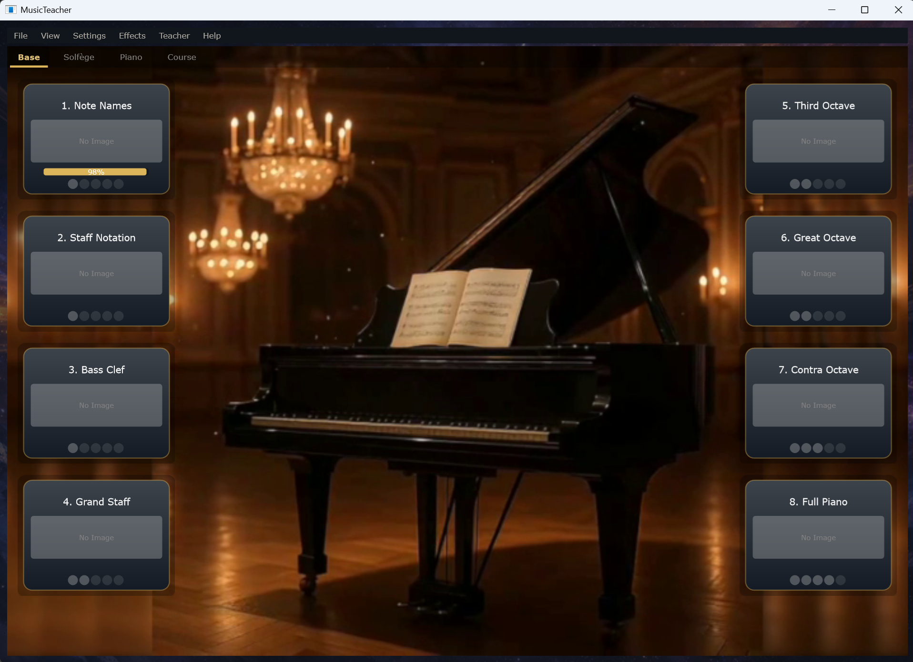

# MusicTeacher — Vidlunnya Music

An open-source music-education platform for students who cannot reach a music school in person.

Built in C++ on [JUCE](https://juce.com) and the [Lomse](https://github.com/lenmus/lomse) music engraving engine. About 76,000 lines of code grown over three years of solo development at [Vasyl Stefanyk Carpathian National University](https://comp-sc.cnu.edu.ua/), Ivano-Frankivsk, Ukraine.

**Status (May 2026):** transitioning from a closed-source project to a fully open-source release. The first public source tranches will land during the project funded by the pending NLnet NGI Zero Commons application (June 2026 round). Until then, this repository hosts the project's identity, roadmap, and metadata.

---

## Who this is for

The student we are building for is anyone who cannot reach a music school in person: families that cannot afford private tuition, learners in places without a local music school, displaced students from war-affected areas, adults who never had a chance at formal music education. For this group, the realistic comparison is not EarMaster at €60+ per seat. It is nothing, or YouTube, or paper exercises with no feedback.

Target level: solid music-school foundations — roughly the level of a Ukrainian *музучилище* or a Polish *szkoła muzyczna*. Below conservatory, well above a hobby app. Works offline, in the student's own language, no subscription.

---

## What runs today

- OpenGL-accelerated sheet-music rendering with sub-frame-precise playback cursor synchronisation
- MIDI input with note-by-note accuracy tracking against the score ("Check VT Mode")
- Piano sampler with ~640 OGG samples covering the keyboard at four velocity layers and both pedal states
- Humanizer DSP block (sustain-pedal modelling, phrase shaping, intro rubato, coda ritardando, and more)
- Master EQ and reverb with live spectrum analysis
- MIDI ↔ MusicXML conversion, VST3 plugin hosting, velocity-curve editor
- UI translated into Ukrainian, English, and Polish
- Text-to-speech through sherpa-onnx with Piper neural voice models (ten voices across the three launch languages)
- A custom lesson scripting language (LessonScript) with built-in localisation
- Fifteen shipped lessons: four rhythm levels (basics, rests, eighth/sixteenth, syncopation), two melody lessons, one dictation lesson, and eight reading-fundamentals lessons (note names, staff notation, both clefs, octave recognition, full piano)

---

## Screenshot

The Base module of the running application — eight structured reading-fundamentals lessons in classical pedagogical order, with per-lesson progress tracking. Top-level tabs reflect the wider curriculum (Base, Solfège, Piano, Course); Solfège is the curriculum area being filled in during the NLnet-funded project.

---

## What's being added in the NLnet-funded phase

Four work-streams:

1. **Finishing** the existing subsystems — closing the open work in the rendering, MIDI, playback, sampler, and Humanizer paths; bringing the lesson-execution flow to a clean state across the existing 15 lessons.
2. **Visual and UX design** — lesson card templates, lesson interior layout, navigation and onboarding, accessibility modes (high-contrast, large-text, dyslexia-friendly font, colour-blind safe palette), unified icon set.
3. **Curriculum gap-filling** — the existing curriculum has no sight-singing track at all, only one dictation lesson, and no separate sight-reading track. The grant pays for the design and validation of a full sight-singing track, a substantial dictation progression, a sight-reading track at music-school level, and translation of new content into the launch languages. Lead consultant: Prof. Dr. Violetta Dutchak, Chair of the Department of Musical Ukrainistics and Folk Instrumental Arts at the same university.
4. **Systematic testing** — automated regression across rendering, MIDI, and playback paths; LessonScript completion-path tests for every lesson; multi-language UI screenshot diffs; documented manual-test protocol for pilot teachers.

iPad, macOS, and Linux ports are deliberately out of scope for this grant — natural targets for follow-on funding once the Windows release is shipped.

---

## Licence

The project is released under **GPL-3.0** (matches the JUCE-GPL framework path and the LGPL Lomse engine; libsodium and sherpa-onnx are permissively licensed and GPL-compatible). Curriculum content is released under **CC-BY-SA**.

See [LICENSE](LICENSE) for the full text.

---

## Roadmap (NLnet-funded phase)

| Milestone | Target | Status |
|---|---|---|
| Public repository established | 2026-05 | done — this file |
| Dependency licence audit complete; first GPL-3.0 source tranche | 2026-08 | pending |
| Finishing pass on rendering and MIDI paths; visual design system v1 | 2026-08 | pending |
| First half of new curriculum (sight-singing + dictation v1); full visual design system shipped | 2026-11 | pending |
| Second half of curriculum (sight-reading + dictation expansion); LessonScript completion-path tests | 2027-02 | pending |
| Full 1.0 Windows release; full curriculum public under CC-BY-SA; case-study report | 2027-05 | pending |

---

## Contributing

The source is not yet public, so we cannot yet accept code contributions. The fastest ways to help right now:

- **Star and watch** the repository — community signal is a real input into the grant decision.
- **Open an issue** if you are a music teacher and have a feature request that would make this useful in your lessons, or if you are a learner who would like a particular kind of practice support.
- **Reach out** if you teach at conservatory or music-училище level and are interested in being a music-domain consultant on the funded curriculum work: musicneutrino@gmail.com.

Once the source is open (target: August–October 2026), normal open-source contribution practices apply. A full `CONTRIBUTING.md` lives in [CONTRIBUTING.md](CONTRIBUTING.md).

---

## Contact

- **Maintainer:** Viktor Rovinkyi — Associate Professor (docent), Department of Computer Science and Information Systems, Vasyl Stefanyk Carpathian National University. Faculty page: https://comp-sc.cnu.edu.ua/staff/viktor-rovinskyi/
- **Email:** musicneutrino@gmail.com
- **Project lead:** Vidlunnya Music (Ukrainian *відлуння*, "echo") — sole-developer entity, registration as ФОП / NGO in progress.

---

## Acknowledgments

- [Lomse](https://github.com/lenmus/lomse) by Cecilio Salmeron — the music engraving engine MusicTeacher renders on top of
- [JUCE](https://juce.com) — the C++ application framework
- [sherpa-onnx](https://github.com/k2-fsa/sherpa-onnx) and [Piper](https://github.com/rhasspy/piper) — the neural text-to-speech stack
- The [W3C Music Notation Community Group](https://www.w3.org/community/music-notation/) for the MusicXML standard
- (Pending) NLnet Foundation and the European Commission's Next Generation Internet initiative

---

*MusicTeacher / Vidlunnya Music is developed in Ukraine.*
